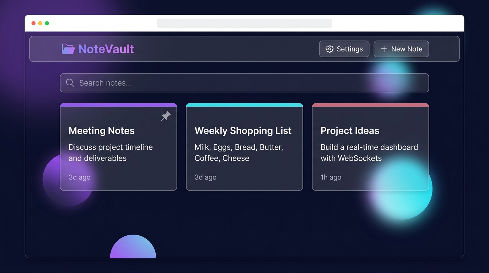

# NoteVault — Smart Note Manager

> A full-stack note-taking web app with a premium glassmorphism UI, built with **Vue 3**, **Node.js/Express**, and **SQLite**.



**Live Demo:** `https://nodevault.vercel.app` *(add your Vercel URL here after deploying)*

---

## Quick Start (Recommended)

> **One command starts both backend + frontend simultaneously.**

```bash
# 1. Clone the repository
git clone https://github.com/your-username/nodevault.git
cd nodevault

# 2. Install all dependencies (first time only)
npm run install:all

# 3. Start both servers
npm run dev
```

Then open → **http://localhost:5173**

---

## Manual Start (Two Terminals)

**Terminal 1 — Backend API (port 3001):**
```bash
cd backend
cp .env.example .env   # copy environment config
npm run dev
```

**Terminal 2 — Frontend (port 5173):**
```bash
cd frontend
npm run dev
```

> The backend **must be running** before the frontend can load notes.

---

## Docker (Bonus)

Run the entire app with a single Docker Compose command — no Node.js installation needed:

```bash
# Build and start both containers
docker-compose up --build

# Stop containers
docker-compose down

# Stop and remove stored data (SQLite volume)
docker-compose down -v
```

Then open → **http://localhost**

The SQLite database is stored in a named Docker volume (`sqlite_data`) so your notes **persist across container restarts**.

---

## Available Commands

| Command | Description |
|---------|-------------|
| `npm run dev` | Start **both** backend + frontend (recommended) |
| `npm run backend` | Start backend only (port 3001) |
| `npm run frontend` | Start frontend only (port 5173) |
| `npm run install:all` | Install dependencies for both projects |

---

## Tech Stack

| Layer | Technology |
|-------|-----------|
| **Frontend** | Vue 3 (Composition API) + Vite |
| **Backend** | Node.js + Express |
| **Database** | SQLite via `better-sqlite3` |
| **Styling** | Vanilla CSS — Glassmorphism design system |
| **HTTP Client** | Axios |
| **Containerisation** | Docker + Docker Compose |

---

## Features

- **Create** notes with title, content, accent colour, and pin toggle
- **View** all notes in a responsive card grid with staggered animations
- **Update** notes via a click-to-edit modal
- **Delete** notes with an animated confirmation dialog
- **Search** notes in real-time (debounced, searches title & content)
- **Pin** notes to keep them at the top
- **12 Themes** — 6 colour families × Dark & Light variants, persisted to `localStorage`
- **Typography** — 7 curated font families (including OpenDyslexic) and 4 scaling sizes
- **Accessibility** — Reduced motion, adjustable line height, letter spacing, and layout density sliders
- **Animations** — Fluid staggered grid loading, dynamic search bar, tactile buttons, and stacking toast notifications
- **Sound Effects** — Web Audio API sounds on create, save, delete, pin, and setting changes
- **Responsive** — works on desktop, tablet, and mobile

---

## REST API Reference

Base URL: `http://localhost:3001/api`

| Method | Endpoint | Description |
|--------|----------|-------------|
| `GET` | `/notes` | Get all notes (supports `?search=` query) |
| `GET` | `/notes/:id` | Get a single note |
| `POST` | `/notes` | Create a new note |
| `PUT` | `/notes/:id` | Update a note (partial update supported) |
| `DELETE` | `/notes/:id` | Delete a note |

**Note body shape:**
```json
{
  "title":   "My Note",
  "content": "Note content here",
  "color":   "#7c3aed",
  "pinned":  false
}
```

---

## Deployment Guide

This app is split across two services for deployment:

| Service | Platform | What it hosts |
|---------|----------|---------------|
| **Backend** | [Railway](https://railway.app) | Node.js API + SQLite |
| **Frontend** | [Vercel](https://vercel.com) | Vue 3 static site |

### Step 1 — Deploy Backend to Railway

1. Push your code to GitHub
2. Go to [railway.app](https://railway.app) → **New Project → Deploy from GitHub repo**
3. Select the repo, set the **Root Directory** to `backend`
4. Add these environment variables in Railway's dashboard:
   ```
   PORT=3001
   DB_PATH=./db/notes.db
   ALLOWED_ORIGINS=https://your-app.vercel.app
   ```
5. Copy your Railway public URL (e.g. `https://nodevault-api.up.railway.app`)

### Step 2 — Deploy Frontend to Vercel

1. Go to [vercel.com](https://vercel.com) → **New Project → Import from GitHub**
2. Set **Root Directory** to `frontend`
3. Add this environment variable in Vercel's dashboard:
   ```
   VITE_API_URL=https://your-railway-url.up.railway.app/api
   ```
4. Deploy — Vercel will auto-detect Vite and build it

### Step 3 — Update CORS on Railway

Once you have your Vercel URL, go back to Railway and update:
```
ALLOWED_ORIGINS=https://your-actual-vercel-url.vercel.app
```

---

## Project Structure

```
nodevault/
├── .gitignore
├── .env.example (→ not committed, see backend/.env.example)
├── docker-compose.yml          ← Docker orchestration
├── package.json                ← Root scripts (concurrently)
├── README.md
├── docs/
│   └── screenshot.png
├── backend/
│   ├── Dockerfile
│   ├── .env.example            ← Copy to .env and configure
│   ├── db/
│   │   ├── database.js         ← SQLite schema + init
│   │   └── notes.db            ← auto-created, git-ignored
│   ├── routes/
│   │   └── notes.js            ← CRUD route handlers
│   ├── server.js               ← Express entry point
│   └── package.json
└── frontend/
    ├── Dockerfile              ← Multi-stage: build + nginx
    ├── nginx.conf              ← SPA fallback + API proxy
    ├── .env.example            ← Copy to .env.local to configure
    ├── src/
    │   ├── assets/
    │   │   └── main.css                ← Global design system (12 themes)
    │   ├── components/
    │   │   ├── NoteCard.vue            ← Individual note card + tooltip
    │   │   ├── NoteModal.vue           ← Create/Edit modal
    │   │   ├── DeleteConfirm.vue       ← Confirmation dialog
    │   │   ├── SearchBar.vue           ← Debounced search
    │   │   └── ThemeSelector.vue       ← Settings panel (theme, typography, a11y, volume)
    │   ├── composables/
    │   │   ├── useTheme.js             ← Theme state (localStorage)
    │   │   ├── useFont.js              ← Typography state (localStorage)
    │   │   ├── useAccessibility.js     ← A11y state (localStorage)
    │   │   └── useSound.js             ← Web Audio API sound engine
    │   ├── services/
    │   │   └── api.js                  ← Axios API layer
    │   ├── views/
    │   │   └── HomeView.vue            ← Main dashboard
    │   ├── App.vue
    │   └── main.js
    ├── vite.config.js          ← Dev proxy → localhost:3001
    └── package.json
```

---

## Development Process — AI Usage

### 1. Glassmorphism Card Design

**Prompt given:**
> "Generate CSS for a glassmorphism note card with a color accent bar at the top, hover lift animation, and hover-reveal action buttons."

**AI output:** A basic card with `backdrop-filter: blur` and a simple box-shadow hover.

**How I modified it:**
- Added a dynamic `--note-color` CSS variable so each card reflects its user-chosen accent colour
- Replaced the generic box-shadow with `color-mix(in srgb, var(--note-color) 20%, transparent)` for a theme-aware glow
- Added the `card-actions` opacity/transform reveal animation (opacity: 0 → 1, translateX(6px) → 0) since the AI only had a static button layout

**Why:** The AI gave the structural foundation; the customisation made the card feel genuinely premium and interactive.

---

### 2. SQLite Schema Design

**Prompt given:**
> "Design a SQLite schema for a notes table that supports a title, content, optional accent color, pinning, and timestamps."

**AI output:**
```sql
CREATE TABLE notes (id INTEGER PRIMARY KEY, title TEXT, content TEXT, created_at DATETIME);
```

**How I modified it:**
- Added `color TEXT DEFAULT '#7c3aed'` and `pinned INTEGER DEFAULT 0` columns
- Changed `DATETIME` to `TEXT` (SQLite stores dates as text; `datetime('now')` is more portable)
- Added `updated_at TEXT DEFAULT (datetime('now'))` and update timestamp logic in the route layer
- Enabled `PRAGMA journal_mode = WAL` for better concurrent read performance

**Why:** The AI suggested only the minimum. Real requirements (colour per note, pinning, update timestamps) needed to be added manually.

---

### 3. Vue 3 Composition API State Pattern

**Prompt given:**
> "Show me a Vue 3 Composition API pattern for managing CRUD state with loading indicators, error handling, and toast notifications in a single view."

**AI output:** A basic `ref` array with a `try/catch` around an API call.

**How I modified it:**
- Structured loading as an object `{ fetch, save, delete }` so each operation has its own independent spinner
- Added a toast queue with auto-dismiss IDs (`toastId++`) instead of a single error string
- Added a debounced search watcher that triggers `fetchNotes()` without flooding the API
- Extracted the `addToast()` helper for reuse across all CRUD handlers

**Why:** The AI gave a starting skeleton; real UX requires granular loading states and non-blocking user feedback.
